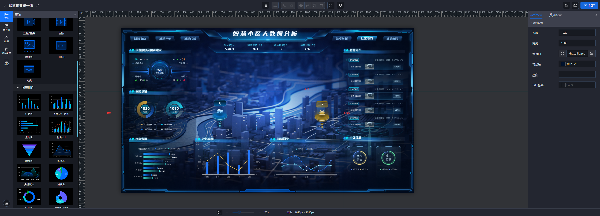

# DAVBI 数据可视化

> 简单易用，轻松私有部署，免费使用的零代码的数据可视化平台

借助新一代计算引擎，我们提供了一个简单易用的平台，让您能够无需编码、轻松拖拽搭建数据可视化大屏。 您可以将 Excel、MySQL、API、MQTT 等多种数据源接入，同时支持实时采集物联网单片机（如 Esp32、Stm32）的数据。 不论是业务监控、生产线管理还是智慧园区等多种场景，我们的平台都能满足您的需求，帮助您快速搭建令人印象深刻的可视化大屏。

## 特点

1. 像做 PPT 一样拖拽搭建数据大屏

借助 PPT 式拖拽操作，用户可以直观地选择和配置各种可视化元素，如图表、图形、文本框等，以呈现数据的不同方面。 用户只需要简单地将这些元素拖拽到所需位置，并进行必要的设置和调整，即可快速创建出令人满意的可视化展示。

2. 私有化部署保证数据的安全

在当今频繁发生数据泄露事件的环境中，保护数据安全变得尤为重要 。 为此，私有化部署提供了一个根本性的解决方案。 相较于 Saas 模式，私有化部署让您完全掌控数据的存储和处理过程。

3. 多种数据源轻松接入

您可以将 Excel、MySQL、API、MQTT 等多种数据源接入，同时支持实时采集物联网单片机（如 Esp32、Stm32）的数据。 当数据改变的时候，能立刻推送到大屏观看到最新的数据，满足多种场景下的需求。

4. 丰富的组件和图表详细的配置

提供丰富的组件库和图表库。它支持多系列展示混合图表，能够轻松实现微前端接入，并且支持接入直播监控等多种接入功能。此外，它还具备灵活性，能够满足个性化需求，让用户根据自己的要求定制和呈现数据可视化。

5. 支持多种操作系统和设备

积极参与多平台生态建设，已适配多种操作系统，能在其上高效稳定的运行。未来将开放更多的平台适配

6. 优惠的价格和完善的服务

可免费使用,在私有部署上我们有极致优惠的价格。有专业的客户经理提供有效的服务和针对性的方案，也提供个性化定制服务， 以极低的成本快速实现高品质项目的交付。

# DAVBI Data Visualization

> A simple, easy-to-use, zero-code data visualization platform that's free to use and easy to deploy privately.

Leveraging a new generation of computing engines, we provide a user-friendly platform that allows you to build impressive data visualization dashboards effortlessly through drag-and-drop, without any need for coding. You can integrate multiple data sources such as Excel, MySQL, API, MQTT, and also support real-time data collection from IoT microcontrollers like Esp32 and Stm32. Whether it's for business monitoring, production line management, or smart campus applications, our platform meets your needs and helps you quickly create impressive visual dashboards.

## Features

1. Drag-and-Drop Dashboard Creation Like PPT

   Using a PPT-style drag-and-drop interface, users can intuitively select and configure various visualization elements such as charts, graphs, text boxes, etc., to present different aspects of the data. Users only need to simply drag these elements to the desired position and make necessary settings and adjustments to quickly create a satisfactory visual display.

2. Private Deployment Ensures Data Security

   In an era where data breaches are frequent, protecting data security has become particularly important. Private deployment offers a fundamental solution to this. Compared to the SaaS model, private deployment gives you complete control over the data storage and processing.

3. Easy Integration of Multiple Data Sources

   You can integrate multiple data sources such as Excel, MySQL, API, MQTT, and also support real-time data collection from IoT microcontrollers like Esp32 and Stm32. When the data changes, it can be immediately pushed to the dashboard to view the latest data, meeting the needs of various scenarios.

4. Rich Components and Detailed Chart Configurations

   We provide a rich library of components and charts. It supports multi-series display hybrid charts, can easily achieve micro-frontend access, and supports various access functions such as live monitoring. Additionally, it is flexible enough to meet personalized needs, allowing users to customize and present data visualization according to their requirements.

5. Supports Multiple Operating Systems and Devices

   Actively participating in the multi-platform ecosystem, our platform is compatible with various operating systems, ensuring efficient and stable operation. More platform adaptations will be opened in the future.

6. Affordable Pricing and Comprehensive Service

   Free to use, we offer extremely affordable prices for private deployments. Professional account managers provide effective services and tailored solutions, as well as customized services, enabling the rapid delivery of high-quality projects at very low cost.